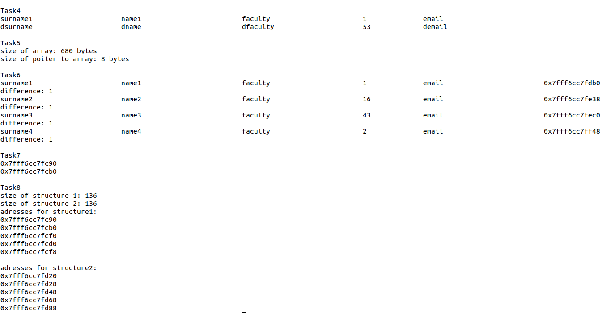

### Тема 5: Практическое задание 
### Задание  
    
    1. Определить комбинированный (структурный) тип, содержащий информацию о студенте: фамилия, имя, факультет, группа, e-mail.  
    2. Выделить статический массив памяти для 30 студентов.  
    3. Выделить динамический массив памяти для заранее неизвестного количества студентов.  
    4. Получить доступ к первому студенту из массива, используя разыменование указателя.  
    5. Вычислить размер памяти, занимаемый массивом студентов.  
    6. Проитерироваться по массиву студентов, используя инкремент указателя. Вывести в консоль адрес каждой структуры студента в памяти. Вывести сообщение о величине, на которую изменяется значение указателя при инкременте.  
    7. Вывести на консоль адреса соседних полей структуры.  
    8. Создать структуру с таким же набором полей, но другой последовательностью. Сравнить размеры структур. Вывести на консоль адреса каждого поля для обеих структур. Сделать выводы.   

Test:  
  
