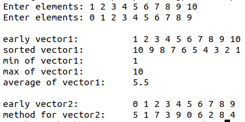

### Задание  
1. Разработать класс «вектор» (одномерный динамический массив). Методы класса: конструкторы, деструктор и методы преобразования массива в соответствии с вариантом.  
2. Ввести 2 массива по 10 элементов, используя различные конструкторы.  
3. Один из массивов отсортировать (четные варианты – по убыванию, нечетные – по возрастанию), найти минимальное, среднее и максимальное значение массива.  
4. Для второго массива выполнить задание по варианту.  
Вариант 4  
Преобразовать массив так, чтобы в первой половине располагались элементы, стоявшие в нечетных позициях, а во второй половине – в четных.  
### Результат  
  