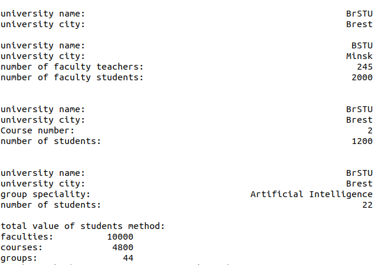

### Задание  
1. Создать базовый класс по варианту, содержащий 2 или более полей, и определить в нем конструктор, деструктор и метод вывода на экран значений полей класса.     
2. Разработать производные классы, в которые добавить минимум 1 поле и собственные методы (конструктор, деструктор, метод вывода на экран значений полей класса и метод, реализующий задание по варианту).  
3. Создать объекты разработанных классов и проверить работу реализованных в них методов.  
Вариант 4  
Базовый класс: университет.    
Производные: Факультет, Курс, Группа.  
Метод: Общее количество студентов.  
### Результат  
  